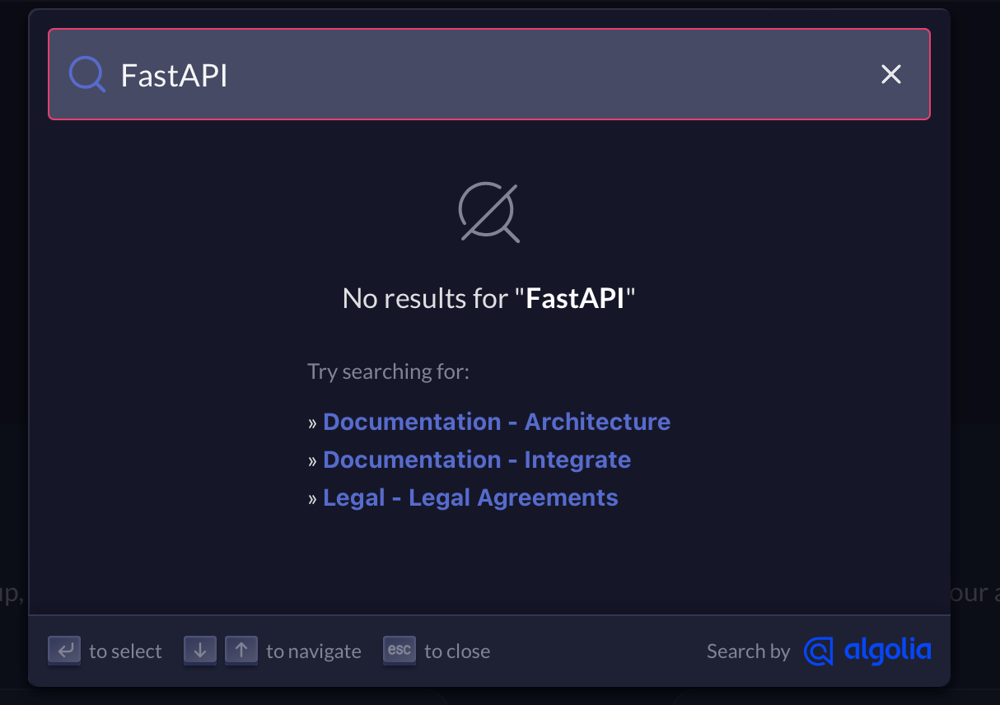
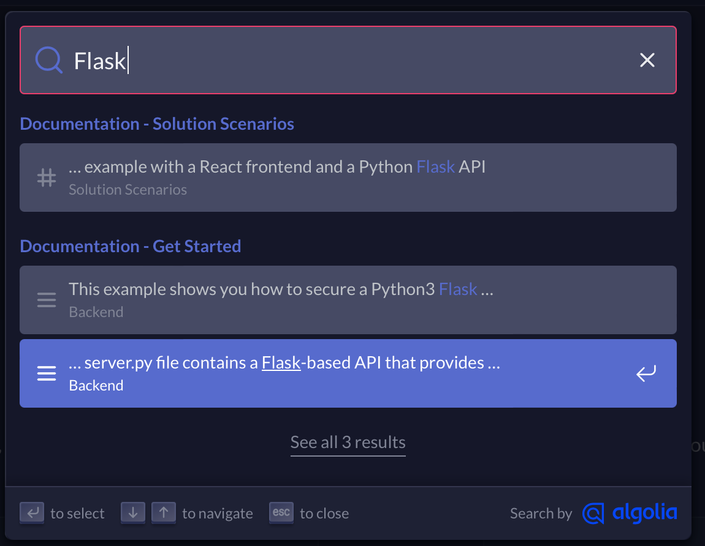

# FastAPI Random Quote Generator with Zitadel Authentication
A while ago I started playing with SSO and different authorization and authentication services. I found [Zitadel](https://zitadel.com), and got a bit curious about it, and decided to try it out.  
Well it was a bit challenging to get it to work to be honest, but I got it working.  
After a while I decided to integrate it with my internal project, to see how it would work in a real world scenario, but due fact that this toll is still really new, and not many people actually use it - obviously you will get only examples and documentation in general and written in popular languages and frameworks.
Inside I'm using FastAPI for small projects, but I couldn't find any examples of how to integrate Zitadel with FastAPI, only Flask :(



So following the documentation and [this example](https://github.com/zitadel/example-quote-generator-app/) you can understand how to integrate Zitadel with your Client/Server application.  
But in case you want to use FastAPI, you need to modify code a bit, I'm still **not sure** if this is the best way to do it, as you still able to use some starlette or other things in `authlib` for making things done, but it works in that way too.  
*if you have any better ways to realise it - PR is welcome*

But also in my way you can get user information on secured routes, using FastAPI Depencency Injection:
```python 
@app.get("/api/custom_quote")
async def custom_quote(user: dict = Depends(auth_required)):
```

and after that you can use it as you want:
```python
for key in user:
        print(f"{key}: {user[key]}")
```
-> 
```python
active: True
scope: openid profile email urn:zitadel:iam:org:project:id:235811786664706051:aud
client_id: 235816966210781187@test1
token_type: Bearer
exp: 1697100034
iat: 1697056834
nbf: 1697056834
sub: 235811272141111299
aud: ['235811815605469187@test1', '235816966210781187@test1', '235811786664706051']
iss: http://192.168.1.130:8080
jti: 235821948221784067
username: zitadel-admin@zitadel.localhost
name: ZITADEL Admin
given_name: ZITADEL
family_name: Admin
locale: en
updated_at: 1697050473
preferred_username: zitadel-admin@zitadel.localhost
email: zitadel-admin@zitadel.localhost
email_verified: True
```

## How to run

1. Clone this repo
2. Rename `sample.env` or `sample2.env` to `.env` and fill it with your data
The difference between `sample.env` and `sample2.env` is that in `sample.env` has been provided in [example](https://github.com/zitadel/example-quote-generator-app/) repo but it has some unnecessary things, so I removed them in `sample2.env`, in anyway you can use both of them, or even create your own `.env` file, not a big deal.
3. Install depends
```bash
poetry install
poetry shell
```
4. Then you can run in and use it in a same project and way as in [example](https://github.com/zitadel/example-quote-generator-app/) repo:
```bash
uvicron app:app --port 5000
```
All other things you can add - goes to FastAPI, so you can use it as you want.

## Source
[Zitadel](https://github.com/zitadel/zitadel) - IMO it's a really cool project, and I think I will use it in some of my future projects, but at the moment it's not best choice for big production.